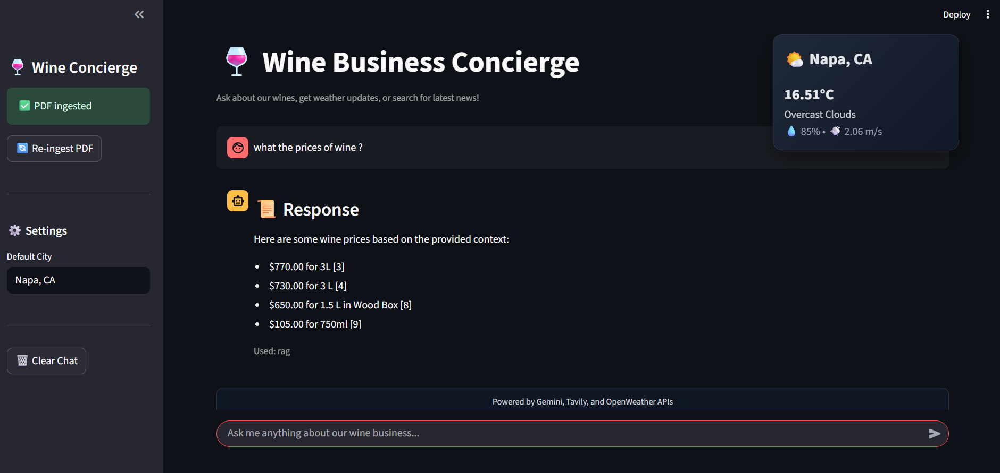

  ## Wine Business Conversational Concierge 🍷  
  #### Wineagent website 🔗[wineagent.streamlit.app](https://wineagent.streamlit.app/)

  

    
    
    
    
    
    
    
  

### *Demo Video 👇🏻*

### Cold start⚠️
`App sometimes may take 1-2 mins after the during cold start !`

#### What this is
- A conversational concierge for a Napa Valley wine business. It answers company-specific questions from a PDF (RAG), performs live web search with citations, and shows real-time weather. Built with LangGraph + Gemini for routing and reasoning, Tavily for fresh links, OpenWeather for conditions, and a polished Streamlit UI with sources, web results, and a fixed weather card.
- Built with a router-first graph that chooses between in-house knowledge (RAG), the web, or weather tools.

#### How it works (architecture)
- Ingestion & Indexing 📜
  - The PDF corpus is chunked (≈1K chars, overlap ≈150) and embedded via Gemini embeddings.
  - Chunks and embeddings are stored locally in a lightweight JSON vector store for portability and speed.

- Retrieval-Augmented Generation (RAG) 🤖 
  - On wine/business questions, the agent retrieves top-k chunks by cosine similarity.
  - The LLM composes grounded answers and returns formatted citations as Source[i] with page hints.

- Web Search 🔍
  - For general/fresh questions, the agent calls Tavily to fetch recent URLs, titles, and snippets.
  - Results are summarized by the LLM with clean bullets and [1],[2] style citations, while raw links appear in an expandable section.

- Weather 🌦️
  - Uses OpenWeather’s Direct Geocoding API to resolve a city into lat/lon.
  - If a name is ambiguous (e.g., “Delhi”), the agent prefers the expected country or the highest‑population match, then queries Current Weather.
  - The UI shows a compact, fixed weather card in the header, controlled by a “Default City” setting.

- Orchestration (LangGraph)
  - A lightweight router analyzes each user query.
  - Routes to: RAG node (PDF), Search node (Tavily), or Weather node (OpenWeather).
  - Short‑term memory is maintained per session via a thread_id on the checkpointer.

UX details
- Streamlit UI provides: chat panel, source expander, web results expander, re‑ingest button, and a fixed weather card.
- Assistant responses are neatly formatted with mode icons and clean spacing.

#### Why this design
- Separation of concerns: Tavily handles finding fresh links; Gemini handles reasoning and summarization; OpenWeather handles weather; RAG keeps answers grounded to the PDF.
- Local, simple vector storage avoids async issues and speeds up startup while remaining easy to version and inspect.

#### Folder map (high level) 📁
- `agent/ingest.py`: PDF → chunks → embeddings → JSON store
- `agent/rag.py`: cosine similarity retrieval over stored embeddings
- `agent/tools.py`: Tavily web search, OpenWeather geocoding + current weather
- `agent/graph.py`: LangGraph router and nodes (rag/search/weather)
- `app.py`: Streamlit interface with weather card and rich citations
- `main.py`: CLI with ingestion and chat modes

---

#### Made by Shriyansh mishra : [mishrashriyansh@outlook.com](mailto:mishrashriyansh@outlook.com)
> Contribution are open for repo 💖
